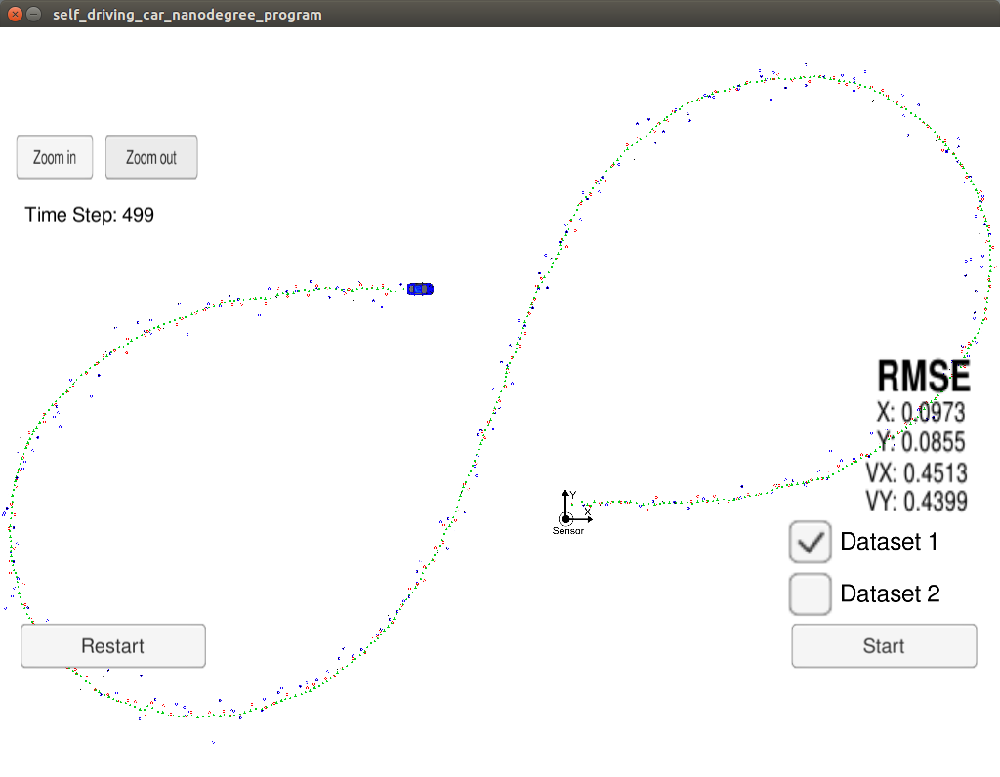
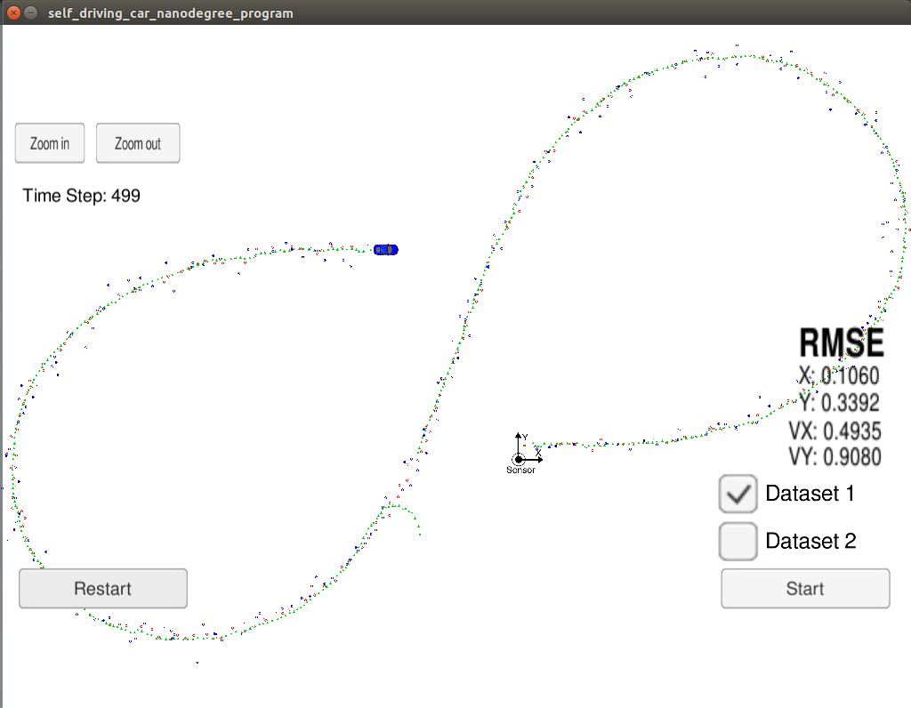

# Extended Kalman Filter Project

### Udacity Self-Driving Car Engineer Nanodegree Program
#### Stewart Teaze; October, 2017

In this project a Kalman Filter was implemented and utilized to estimate the state of a moving object of interest, with noisy lidar and radar input measurements. Passing the project requires obtaining RMSE values that are lower that the tolerance outlined in the project rubric. 

This project was implemented on a Ubuntu 17.04 Linux x86 system, and the GitHub repository for all source, object, build, and image files included in the project submission are located at: https://github.com/blunderbuss9/CARND-T2P1-EKF

This project involved the installation and use of the Term 2 Simulator which was downloaded from [this location](https://github.com/udacity/self-driving-car-sim/releases).   This repository included files to install [uWebSocketIO](https://github.com/uWebSockets/uWebSockets) for various systems, including the target Linux system environment I used to develop and test the project kalman filter source/object code.  For Linux, the installation simply involved running the provided installation script install-ubuntu.sh.  NOTE: The simulator and uWebSocketIO files themselves are not included in the project submission GitHub repository, as they are available separately, and are themselves larger than the 100MB normal user limit on GitHub repositories.

---

## Description of Modified Source Code Files

The files that were modified to complete the project were src/FusionEKF.cpp, src/FusionEKF.h, kalman_filter.cpp, kalman_filter.h, tools.cpp, and tools.h

**FusionEKF.cpp & FusionEKF.h -** These files compose the C++ Class FusionEKF(), which contain a) a class object KalmanFilter::ekf_ which itself contains the general kalman filter state and covariance matrices, b) definitions for the non-general (Lidar or Radar-specific) kalman filter-related matrices that are setup, maintained, and passed to the LIDAR or RADAR specific kalman filter update functions defined in the KalmanFilter() class files, and c) the code, which includes the FusionEKF() constructor in which the kalman filter matrices (F, H_laser, H_jacobian, P, etc.) are initialized; and the function ProcessMeasurement(), which is called  from the main loop in main.cpp, each time a LIDAR or RADAR measurement is received from the simulator, to perform the following functions:

1. Initialize the KalmanFilter::ekf_.x_ filter position vector with the first sensor measurement package received, and at the same time initialize the previous_timestamp value, used for calculating and setting up the Delta-T time values in the F and Q matrices used in the prediction cycle for each subsequent measurement package received.

2. For each subsequent measurement package received (after the initial):

   a. Modify the F and Q matrices prior to the prediction step based on the elapsed time 	between measurements (Delta-T).

   b. Invoke the proper update function for either the LIDAR or RADAR sensor measurement. Because the update step for LIDAR and RADAR are slightly different, there are different functions for updating LIDAR and RADAR, which are defined in the class KalmanFilter().

**kalman_filter.cpp & kalman_filter.h -** These files compose the C++ Class KalmanFilter(), which define a) the class object definitions of the general kalman filter state and covariance matrices, and b) the Predict(), and Update() (or UpdateEKF()) functions, invoked by FusionEKF::ProcessMeasurement, each time a measure package is received from the simulator.   Predict() implements the equations shown in the **Prediction** steps in the left column of the image below (the same Predict() processing is performed when both LIDAR and RADAR measurement packages are received).  Update() implements the **Measurement Update** steps shown in the left column of the image below (and is called for only the LIDAR measurement updates).  UpdateEKF() implements the modified **Measurement Update** steps for the Extended Kalman Filter implementation - modified as described by the notes in the right column of the image below (and is called only for RADAR measurement updates):

**tools.cpp and tools.h -**

## Provided Files

The provided file main.cpp, was not modified permanently in any way (temporary output statements were added to aid in debugging the implementation, but these statements have been removed from the final project submission version of main.cpp).

## Output Screen Captures

This screen capture of the Simulator program window, shown after completion of a test run , made against the final version of the submitted project source/object code, and made with the provided test data, show the final accumulated RMSE calculated values within the required tolerance:

This following screen capture of the Simulator program window, shown after completion of a prior to final test run with the provided test data, <u>made during a test run before the final version was completed</u>, and with a mis-calculation still remaining in the "normalization" of the y(1) parameter, after the y - z - HOfXPrime calculation in the UpdateEKF() function in the kalman_filter.cpp file (the y(1) angle value was being "under-normalized" by adding or subtracting PI, rather than 2 * PI), show the final calculated X, Y, and RMSE values not within the required tolerance, and with abnormalities in the estimated (green) triangles, occurring briefly after the vehicle passes back under the y=0 axis.  This anomaly was corrected in the final submitted version of the project code, and output (as seen in the first screen capture above):

### Basic Build Instructions

1. Clone this repo.
2. Change current directory to the build directory: `cd build`
3. Compile: `cmake .. && make` 
4. Run the Extended Kalman Filter executable: `./ExtendedKF `
